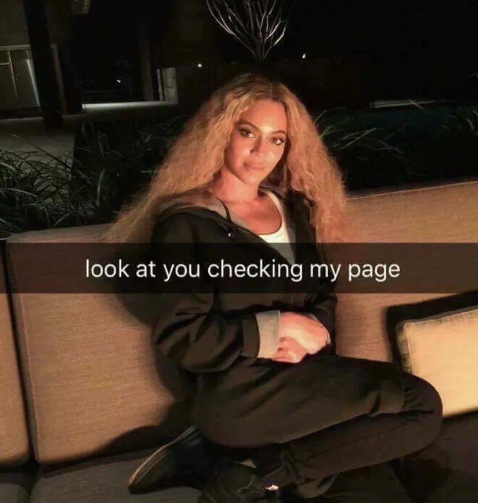

# Hi, I'm Vanessa 👋🏻

### AI Agentic Engineer & O.G Full Stack Developer

---

💅🏽 I've been building web & mobile experiences for **almost 20 years**. Slick UIs, complex backends, AI systems, and the tricky problems that come with all three. **TypeScript**, **React**, **Node.js**, **Rust** and **Swift** are my daily tools, and **AI-driven development** is how I work now.

Based in **Paris, France** 🇫🇷 · self-taught, shipping since 2006 for **50+ enterprise clients**, with stints in **London**, **New York**, **Orlando** and **Stockholm**.

🗣️ English · Français · 中文 (learning)  

Some of the companies that hired me as a freelancer: **Airbus** · **L'Oréal** · **Total** · **Orange** · **Canal+** · **Renault** · **AXA** · **Allianz** · **Carrefour** · **Dell** · **Sanofi** · **Royal Canin** · **Epson** · **SNCF** · **TF1** · **ING Direct** · **Caisse des Dépôts** · **Kogama** and more...

🤖 Deep into **AI agents**: I built [free-coding-models](https://github.com/vava-nessa/free-coding-models), a TUI to find, benchmark & install free coding LLMs, now at **2.5k+ GitHub Stars** ⭐. I also built [kandown](https://github.com/vava-nessa/kandown), the memory layer for long-running agent loops: every task is a plain Markdown file, readable by you and your agents from a web board, a TUI or the CLI.

🎬 Before the code, I spent **15 years in audiovisual**: director and live streamer, setting up the RTMP servers and running broadcasts for live events, TV and YouTubers. Same instinct as shipping software, except live has no second take.

🔨 Right now I'm heads-down on **three builds**: two healthcare apps (**React Native** & **Flutter**) and an AI app for macOS in **Swift**, shipping soon.

I dev daily on a **M4 Pro**, with **Omarchy Linux** as a local VPS for my **Hermes** agent, **herdr / moshi** and a bunch of **local models**.

🎶 When I'm not coding, I'm making electronic music (Ableton + way too many VSTs), reading AI research papers, cuddling my cats and raising 2 teenagers. Geography nerd too 🌍

---

  
  

---

## 🛠️ Open Source Projects

- **[free-coding-models](https://github.com/vava-nessa/free-coding-models)** 📊 · TUI tool to find, benchmark & install free coding LLMs · 2.5k+ GitHub Stars ⭐️ · [npm](https://www.npmjs.com/package/free-coding-models)
- **[kandown](https://github.com/vava-nessa/kandown)** ✅ · The memory layer for long-running agent loops: file based Kanban in plain markdown, zero backend, AI agent friendly · [kandown.dev](https://kandown.dev) · [npm](https://www.npmjs.com/package/kandown)
- **[AI Snitch](https://github.com/vava-nessa/AISnitch)** 🧠 · Cross platform universal AI CLI activity bridge · [npm](https://www.npmjs.com/package/aisnitch)

---

## 🚀 Upcoming projects, work in progress

- **[Out of Burn](#)** 🔥 · AI assisted mental health tracker. Guided routines, mood tracking & supportive tools to help people recover from burnout
- **[Pylz](#)** 💊 · Beautifully designed medication reminder. Clear UI & accessibility first, for memory or cognitive difficulties
- **[NexTTY](#)** 📟 · Next generation developer terminal designed for AI agents and AI driven coding. macOS native, agent orchestrator inside, shipping soon
- **[ModelRadar](https://www.modelradar.dev)** ⭐️ · Discover, evaluate & track the latest AI coding models, tools and more · [repo](https://github.com/vava-nessa/modelradar)

---

My daily harness: **Ghostty** with **Claude Code** in one tab and **Codex** in the other, **opencode** for whatever open model earns the seat, **Hermes agent** as second brain writing everything down in **Obsidian**, **herdr** to follow one tab per task from the Mac to the iPhone, and **Zed** to read the diff.

---

## 🧰 Tech I love
[JavaScript](https://developer.mozilla.org/en-US/docs/Web/JavaScript) · [TypeScript](https://www.typescriptlang.org) · [Rust](https://www.rust-lang.org) · [Python](https://www.python.org) · [Astro](https://astro.build) · [Next.js](https://nextjs.org) · [React](https://react.dev) · [Tanstack Start](https://tanstack.com/start) · [Vite](https://vitejs.dev) · [Tailwind CSS](https://tailwindcss.com) · [shadcn/ui](https://ui.shadcn.com) · [WebGL](https://www.khronos.org/webgl/) · [Babylon.js](https://www.babylonjs.com) · [Swift](https://swift.org) · [SwiftUI](https://developer.apple.com/swiftui/) · [React Native](https://reactnative.dev) · [Expo](https://expo.dev) · [Node.js](https://nodejs.org) · [PostgreSQL](https://www.postgresql.org) · [Prisma](https://www.prisma.io) · [Supabase](https://supabase.com) · [Vercel](https://vercel.com) · [PostHog](https://posthog.com) · [Claude](https://claude.ai) · [Codex](https://openai.com/codex) · [Opencode](https://opencode.ai) · [Gemini CLI](https://github.com/google-gemini/gemini-cli) · [Ghostty](https://ghostty.org) · [Alacritty](https://alacritty.org) · [Zed](https://zed.dev) · [Obsidian](https://obsidian.md)

---

---

### 🔗 [vavanessa.dev](https://vavanessa.dev) &nbsp;·&nbsp; 📄 [vanessadepraute.dev](https://vanessadepraute.dev) &nbsp;·&nbsp; 📝 [Notes](https://vanessadepraute.dev/notes) &nbsp;·&nbsp; 💼 [LinkedIn](https://www.linkedin.com/in/vanessa-depraute-310b801ba/) &nbsp;·&nbsp; 🐦 [@vavanessadev](https://x.com/vavanessadev) &nbsp;·&nbsp; 📦 [npm](https://www.npmjs.com/~vava-nessa) &nbsp;·&nbsp; 🦄 [GitHub](https://github.com/vava-nessa)

---

  
  
   

